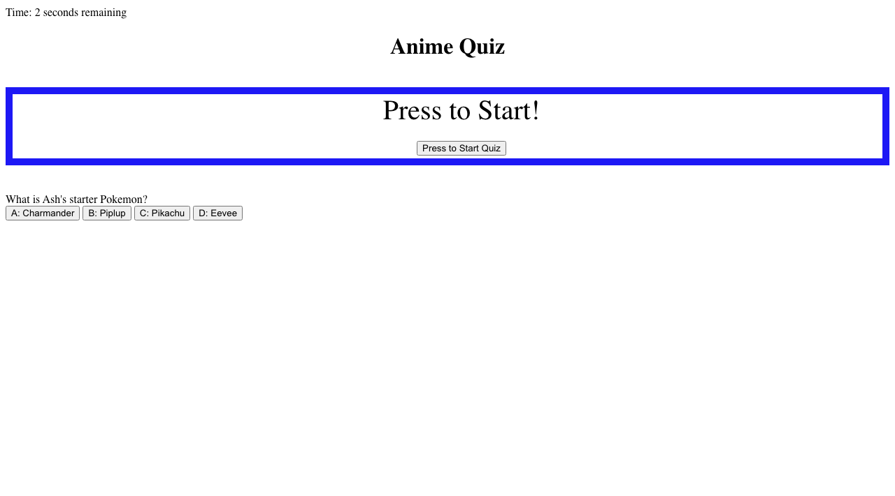

# hw4-mh-codequiz

A website with a Code Quiz UI

This is an application that incorporates the usage of HTML, CSS, and Javascript. This application emphasizes the use of Javascript to provide quiz questions tracks inputted data to see if its correct then saves the results generated in total score and appends to the page as well as saves within local storage.

## Acceptance Criteria

```
GIVEN I am taking a code quiz
WHEN I click the start button
THEN a timer starts and I am presented with a question
WHEN I answer a question
THEN I am presented with another question
WHEN I answer a question incorrectly
THEN time is subtracted from the clock
WHEN all questions are answered or the timer reaches 0
THEN the game is over
WHEN the game is over
THEN I can save my initials and score

```

* [GitHub Repository](https://github.com/basedmilz/hw4-mh-codequiz)
* [Deployed GitHub Website](https://basedmilz.github.io/hw4-mh-codequiz/)

## Mockup: 



